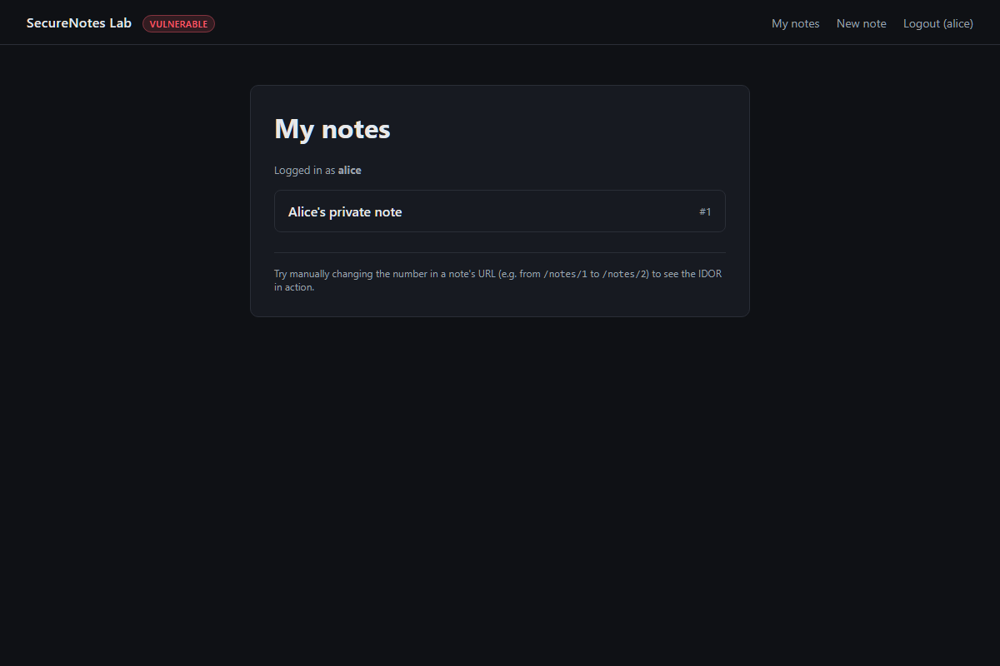
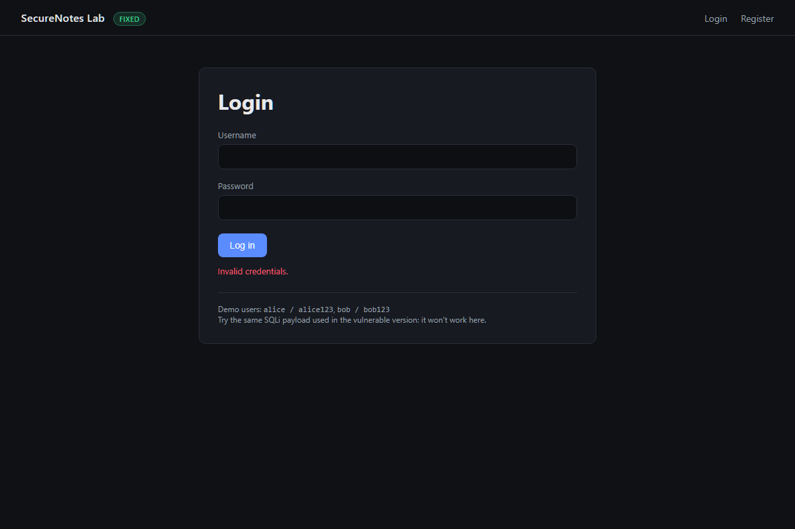
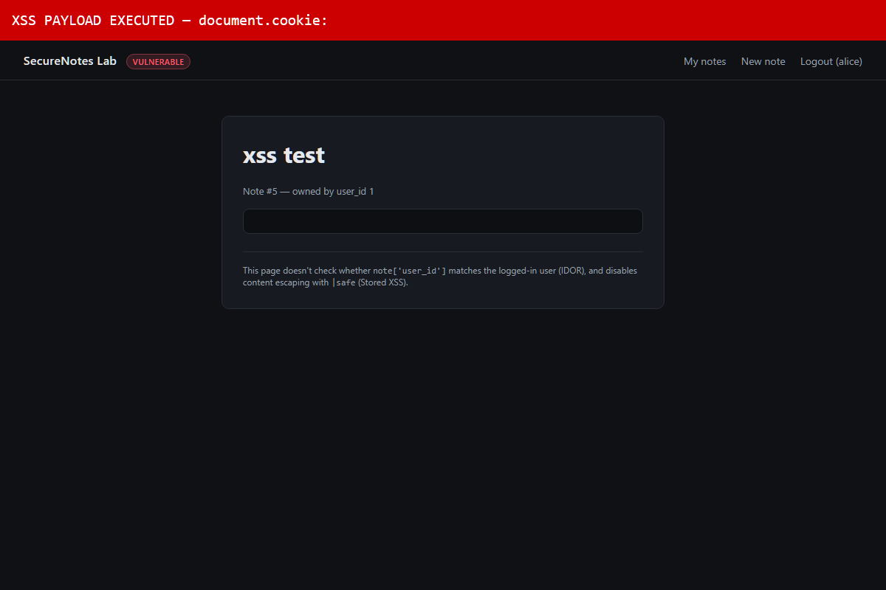
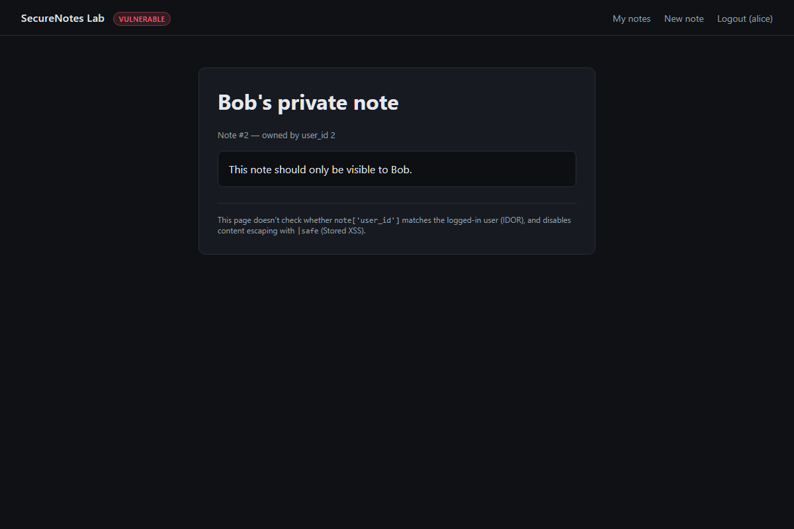
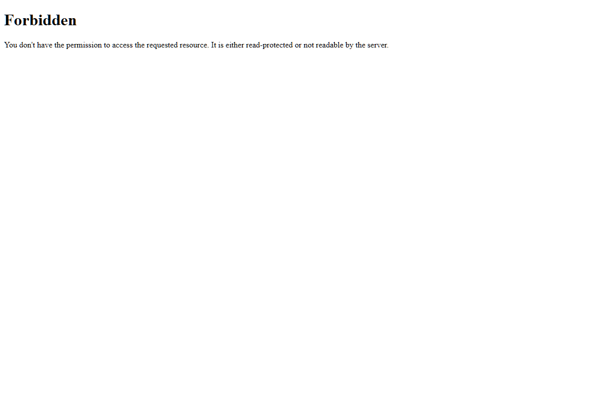
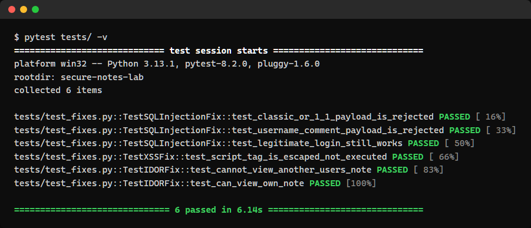

# SecureNotes Lab

[](https://github.com/MihaelaAghirculesei/secure-notes-lab/actions/workflows/tests.yml)
[](https://github.com/MihaelaAghirculesei/secure-notes-lab/actions/workflows/security.yml)

A personal notes application built **twice**: once with 4 intentional vulnerabilities (OWASP Top 10), once fixed — with automated tests proving the fixes actually work.

> Educational/portfolio project. Meant to run **locally only**. The `vulnerable/` folder must never be exposed on the internet or used with real data.

## Why this project

Most security portfolios show "I found a bug in an app that was already built" (e.g. DVWA, WebGoat). Here it's the other way around: **I wrote the vulnerable code myself, understanding exactly why it's wrong, and then fixed it** — the same cycle a role bridging development and security actually requires in the real world.

## The 4 vulnerabilities (OWASP Top 10) + 1 bonus

| # | Vulnerability | OWASP category | Where |
|---|---|---|---|
| 1 | SQL Injection in login | A03:2021 – Injection | `vulnerable/app.py` → `login()` |
| 2 | Stored XSS in note content | A03:2021 – Injection | `vulnerable/templates/note_detail.html` |
| 3 | IDOR in note viewing | A01:2021 – Broken Access Control | `vulnerable/app.py` → `view_note()` |
| 4 | Passwords stored in plaintext | A02:2021 – Cryptographic Failures | `vulnerable/database.py` |
| 5 (bonus) | CSRF on every state-changing POST | A01:2021 – Broken Access Control | `vulnerable/app.py` → `login()`, `register()`, `new_note()` |

Full details, exploitation steps, and impact: [`docs/VULNERABILITIES.md`](docs/VULNERABILITIES.md)
Before/after code comparison with mechanism explained: [`docs/REMEDIATION.md`](docs/REMEDIATION.md)

## Screenshots

### 1. SQL Injection — bypassing login

**Vulnerable version:** logging in with `' OR '1'='1' --` and any password succeeds.


**Fixed version:** the same payload is rejected.


### 2. Stored XSS — script execution

**Vulnerable version:** a note containing a `<script>` payload executes in the browser.


### 3. IDOR — accessing another user's note

**Vulnerable version:** logged in as alice, visiting `/notes/2` shows bob's private note.


**Fixed version:** the same request returns a 403 Forbidden.


### 4. Automated proof

All 6 tests pass against the fixed version, proving the fixes hold.


## Tech stack

- Python 3 + Flask (backend, routing, Jinja2 templates)
- SQLite (storage, zero configuration)
- Werkzeug security (password hashing in the fixed version)
- pytest (automated tests against the fixed version)

## How to run the project

```bash
git clone <this-repo-url>
cd secure-notes-lab
pip install -r requirements.txt
```

**Vulnerable version** (port 5000):
```bash
cd vulnerable
python app.py
```

**Fixed version** (port 5001):
```bash
cd fixed
python app.py
```

Demo users in both versions: `alice / alice123`, `bob / bob123`.

## Running the automated tests

```bash
pytest tests/ -v
```

The tests prove with code, not just words, that on the fixed version:
- classic SQL injection payloads are rejected and legitimate login still works;
- a `<script>` payload is shown as escaped text, not executed;
- a user cannot view another user's note (403 response).

## Repository structure

```
secure-notes-lab/
├── vulnerable/    # version with the 4 intentional vulnerabilities
├── fixed/         # same app, vulnerabilities fixed
├── tests/         # automated tests against the fixed version
├── docs/
│   ├── VULNERABILITIES.md   # detailed write-up of each vulnerability
│   └── REMEDIATION.md       # before/after code comparison, explained
└── requirements.txt
```

## What this project demonstrates

- Practical (not just theoretical) understanding of 4 OWASP Top 10 vulnerabilities, from both the attack and defense side.
- Ability to write automated tests as proof of security, not just proof of functionality.
- A background as a software developer applied to a security problem — the meeting point between the two skill sets.

## Background

This project is part of a career transition path toward cybersecurity roles (Junior SOC Analyst / Security Analyst), coming from a background as a software developer.

## License

MIT — see [LICENSE](LICENSE).
